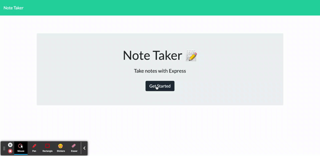

# Note_Taker-X

## Description

This project creates an app for note taking 

## Table of Contents

* [Installation](#installation)

* [Usage](#usage)

* [License](#license)  

* [Contributing](#contributing)

* [Tests](#tests)

* [Tests](#tests)

* [Questions](#questions)

## Installation

To install necessary dependencies, run the following command:

npm i

## Usage

NPM Start

## Contributing

Contact me.

## Tests

To run tests, run the following command:

npm test

## Questions

If you have any questions, you can contact me directly at jeodom17@gmail.com. You can find more of my work at [github/jeodom17](https://github.com/jeodom17).